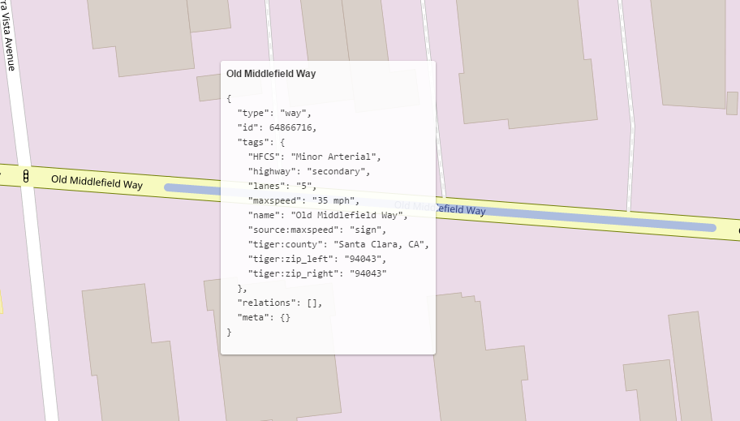

# Road selection with Overpass and Leaflet

This is a quick demo project to demonstrate road selection on a Leaflet map around the point where user have clicked.
It uses Overpass API to fetch road coordinates.



## Running
You need nodejs installed.
Run
```bash
npm install
npm start
```
Then open browser at `localhost:3000` and try to click on any road.